# Evaluación de los IDEs

## Instalación de entornos de desarrollo propietarios y libres

### Diferencias proceso instalación IDE propietario vs libre

Para realizar a cabo este proyecto he decidido instalarme los siguientes IDEs:

- Propietario: IntelliJ IDEA (Jetbrains)

Este es el IDE de pago por excelencia para Java y Kotlin el cual nos ofrece gran cantidad de funcionalidades que veremos más adelante. 

Se puede descargar a través del siguiente enlace: 

[Enlace Descarga IntelliJ IDEA](https://www.jetbrains.com/idea/)

- Libre: Visual Studio Code (Microsoft)

Antes de empezar, cabe destacar que aunque sea un editor de texto en sí mismo, a través de la implementación de plugins y herramientras propias de un IDE como compiladores, intérpretes o debuggueadores realmente es considerado por muchos como un IDE debido a la versatilidad que éste nos aporta.

Se puede descargar a través del siguiente enlace:

[Enlace Descarga VSC](https://code.visualstudio.com/)

Para evidenciar las diferencias, he documentado los pasos principales con capturas de pantalla para ambos entornos:

#### **Visual Studio Code**

Antes de empezar la instalación tenemos que aceptar el acuerdo de condiciones y políticas de privacidad, por lo tanto es recomendable leérselo con el fin de saber que estamos aceptando al utilizar este IDE. Aunque os adelanto que e acuerdo de licencia es sencillo puesto que únicamente requiere aceptar la licencia MIT, con enlaces al proyecto Open Source de Microsoft.

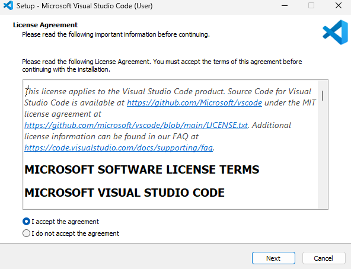

Asimismo, la instalación es ligera, rápida y con requisitos mínimos (434 MB). Se instala fácilmente en la carpeta del usuario (`AppData\Local\Programs\Microsoft VS Code`) siempre que no deseemos cambiarla.

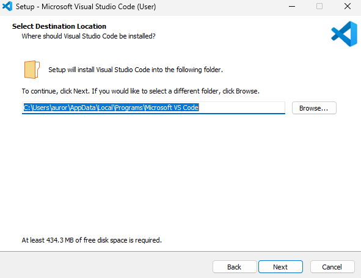

También nos permite seleccionar tareas adicionales como crear accesos directos y registrar el editor en el PATH, muy útil para desarrolladores.

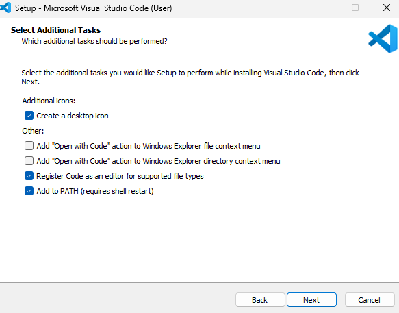

Una vez instalado, en el primer arranque ya podemos apreciar como la interfaz inicial es minimalista y accesible, mostrando directamente las funciones básicas.

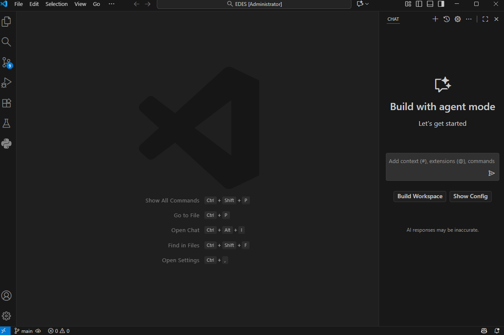

#### **IntelliJ IDEA**
En este caso el proceso de instalación es más guiado, con recomendaciones iniciales para asegurar una instalación profesional (por ejemplo, cerrar otras aplicaciones).


De la misma forma nos pide seleccionar carpeta de instalación en `Program Files`, y requiere mucho más espacio (4.7 GB), lo que indica herramientas integradas y mayor robustez.

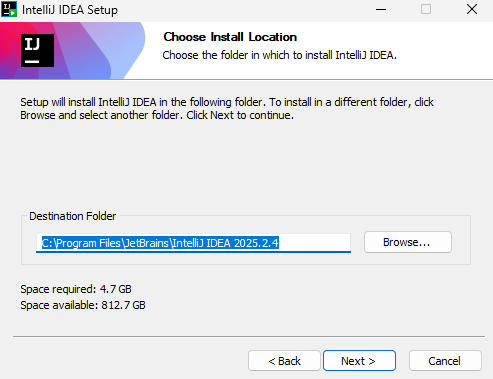

Asimismo, permite configurar asociaciones específicas para archivos de programación (.java, .gradle...), orientado a proyectos avanzados.

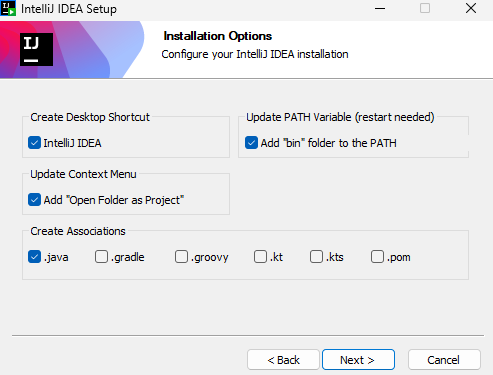
Finalmente, la pantalla final es más formal, con opción de iniciar automáticamente el IDE y una bienvenida guiada. Incluso ofrece tutorial onboarding para nuevos usuarios.

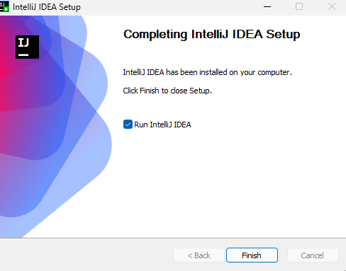

Una vez iniciado, la pantalla inicial se ve aún más profesional que la de Visual Studio Code, como se muestra a continuación:

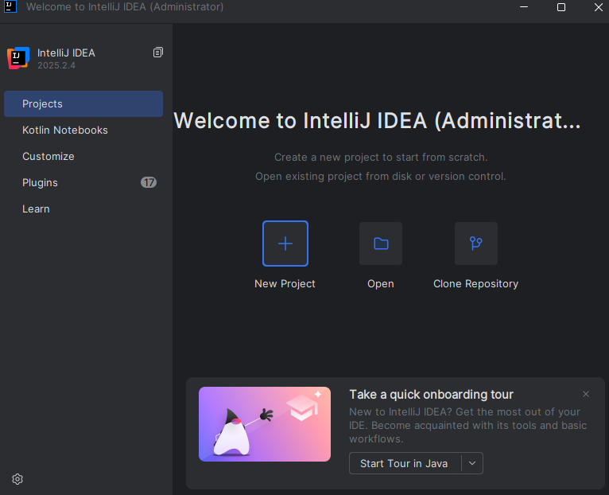

**Conclusión comparativa**

- **VS Code**, como entorno libre, destaca por la agilidad y sencillez del proceso, accesible para cualquier usuario, sin trabas ni requerimientos avanzados.
- **IntelliJ IDEA**, entorno propietario, sobresale por el enfoque profesional, la customización y la robustez del proceso, aunque requiere más recursos y pasos.


### ¿Qué ventajas identificaste en cada uno de los entornos durante la instalación?

### **Visual Studio Code**

- **Agilidad del proceso**: Instalación muy rápida y ligera, que requiere pocos recursos y espacio en disco. En menos de un minuto está listo para usar, lo que facilita el acceso incluso en equipos con hardware limitado.
- **Simplicidad y claridad**: Todo el proceso es intuitivo y directo, sin pasos innecesarios ni requisitos de registro, pago o verificación por licencia.
- **Personalización inicial**: Permite desde el primer momento elegir opciones como la creación de accesos directos, asociación de archivos y registro en el PATH, lo que resulta muy útil para desarrolladores que buscan comodidad y versatilidad en el uso diario.
- **Accesibilidad**: No necesita datos personales ni información privada para poder instalarlo puesto que el usuario es totalmente independiente, lo que lo convierte en una solución flexible y segura.
- **Interfaz minimalista y abierta**: En el primer arranque, la interfaz es clara y moderna, lista para empezar a trabajar o personalizarla con plugins/extensiones según las necesidades del usuario.

### **IntelliJ IDEA**

- **Instalación guiada y profesional**: Desde el inicio, el asistente de instalación ofrece recomendaciones y opciones pensadas para desarrolladores avanzados (como cerrar aplicaciones activas para evitar conflictos). Ya tan solo por esos mínimos detalles el proceso se percibe más profesional y detallado.
- **Opciones avanzadas de configuración**: Permite elegir asociaciones de tipos de archivo (.java, .gradle...) y añadir utilidades al menú contextual, lo que facilita el trabajo con proyectos de gran escala y diferentes tecnologías.
- **Robustez y potencia**: El requerimiento de espacio (4.7 GB) anticipa la cantidad de herramientas profesionales ya incluidas, lo que ahorra tiempo en configuraciones posteriores.
- **Experiencia integral para el usuario**: La pantalla final incluye directamente la opción de iniciar el IDE y realizar un tour guiado, favoreciendo el aprendizaje para nuevos usuarios.
- **Preparación para desarrollo profesional**: Está pensado para grandes proyectos de ingeniería de software, lo que se nota en la profundidad de sus opciones y el entorno de trabajo altamente especializado.

## Gestión de módulos y extensiones en el entorno de desarrollo

### Visual Studio Code

En Visual Studio Code he decidido instalarme el plugin de Pylint.
La instalación del plugin **Pylint** ha aportado una mejora radical a mi flujo de trabajo con Python puesto que me ayuda a detectar errores y problemas de estilo en tiempo real, lo que me permite anticipar y corregir fallos antes de ejecutar el código, resultando fundamental para garantizar la calidad, legibilidad y coherencia del proyecto desde el primer momento.

Además, gracias a la gestión intuitiva de extensiones, puedo añadir funcionalidades específicas según las necesidades del proyecto. Por ejemplo, combinando Pylint con otras extensiones como **Prettier** para formatear el código automáticamente, consiguiendo que el desarrollo en Visual Studio Code sea mucho más eficiente y profesional.

*Ejemplo formateo Prettier*


En definitiva, **Visual Studio Code destaca por la facilidad y rapidez para instalar cualquier plugin**, permitiendo personalizar el entorno según las necesidades concretas de cada proyecto y perfil de desarrollador.

El proceso de instalación en Visual Studio Code es muy sencillo, puesto que si accedemos al apartado de Extensiones (Plugins) desde la barra lateral nos redirigirá automáticamente al apartado en donde podemos descargarnos las extensiones deseadas, como se muestra a continuación:

 

Una vez en el apartado de extensiones procedemos a buscar la extensión según nuestros intereses, en este caso he optado por Pylint como se mencióno anterormente.

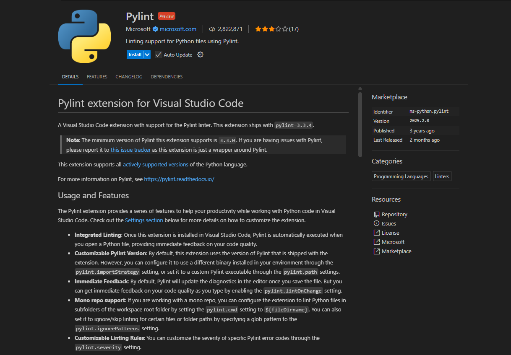

*Ejemplo de funcionamiento*


Como podemos observar, esta extensión nos muestra advertencias y mensajes informativos que aunque no sean errores que corten el flujo del programa es de vital importancia solucionarlos para mayor profesionalidad.

### IntelliJ IDEA
### IntelliJ IDEA

En IntelliJ IDEA he decidido que la mejor extensión que me podía instalar es la que da soporte a Kotlin puesto que más adelante en el curso trabajaremos con este excelente lenguaje de programación sucedáneo del lenguaje orientado a objetos por excelencia Java.

En este caso, para proceder a la instalación de extensiones desde el propio IDE también es muy sencillo puesto que desde la pantalla de inicio en la barra lateral podemos observar una opción que nos redirige directamente al apartado de la instalación de los plugins o extensiones, como se observa a continuación:


Una vez dentro, buscamos la extensión de nuestra preferencia, en este caso Kotlin, la cual nos aporta un soporte avanzado para el lenguaje, facilitándonos el desarrollo de software.

La instalación del **plugin de Kotlin** transforma IntelliJ IDEA en un entorno robusto y preparado para el desarrollo con este lenguaje. El soporte avanzado incluye autocompletado inteligente, refactorización guiada, integración con sistemas de dependencias y testeo simplificado. Esto facilita el desarrollo de aplicaciones modernas, acortando los tiempos de búsqueda, configuración y resolución de problemas durante la programación.

*Ejemplo integración de Git en IntelliJ IDEA*


IntelliJ IDEA sobresale, además, por la profundidad y calidad de sus plugins. Por ejemplo, al añadir **GitToolBox** consigo información de control de versiones directamente integrada en el editor, acelerando las tareas de colaboración y gestión de código fuente.

**Comparación final**
Instalar y utilizar extensiones es sencillo en ambos IDE, pero Visual Studio Code sobresale por la flexibilidad y rapidez para ampliar funcionalidades, mientras que IntelliJ IDEA destaca por la profundidad y calidad de los módulos que incorpora, ideal para proyectos avanzados y exigentes.

## Personalización y automatización del entorno 

### Visual Studio Code

Para empezar, con el objetivo de reducir mi fatiga visual durante sesiones largas de trabajo me instalé la extensión One Dark Pro haciéndome más agradable la experiencia y mejorando mi concentración.

*Antes*

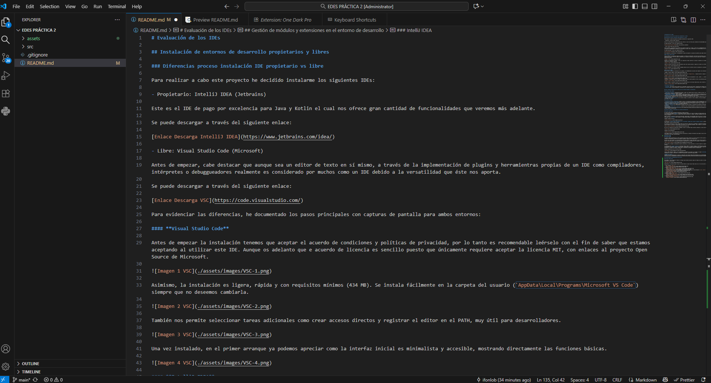

*Después*

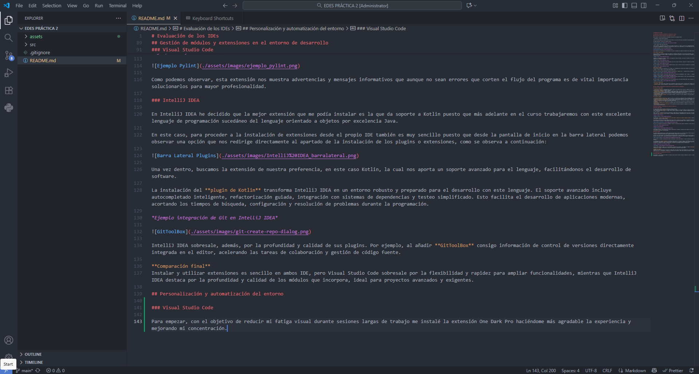 

Seguidamente, he ajustado algunos atajos de teclado desde el propio Visual Studio Code con el fin de facilitar y agilizar el trabajo. 

1. Abrir Terminal `(Ctrl + T)`
   
   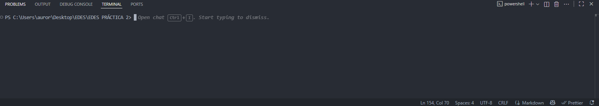
2. Duplicar línea `(Shift + ↓)` 
    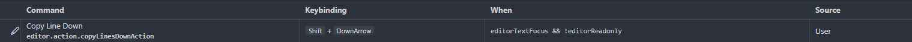
    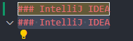
3. Ver previsualización de un archivo Markdown con la extensión de *Markdown Preview Enhancer* (`Ctrl + Shift + V`)
    
    *Imagen de ejemplo*
    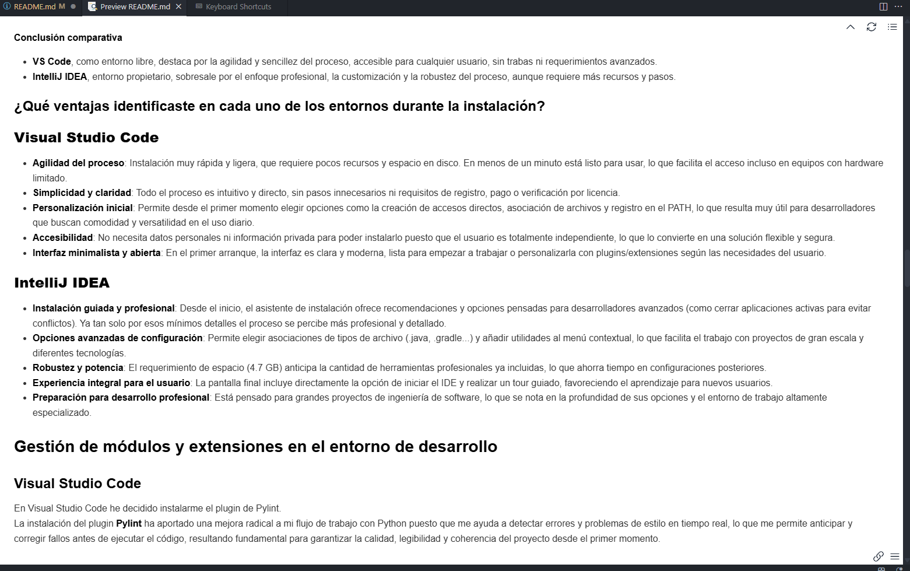
4. Eliminar Línea (`Ctrl + K`)
   
5. Edición Múltiple (`Ctrl + D`)
    
    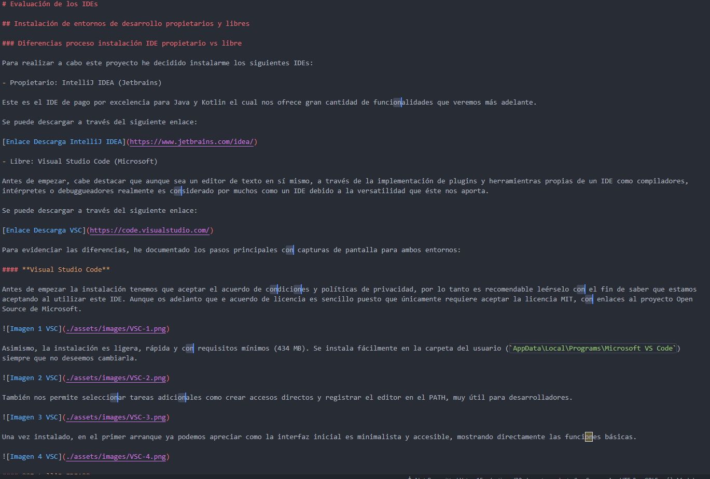
6. Buscar en un archivo (`Ctrl + Shift + F`)
    
    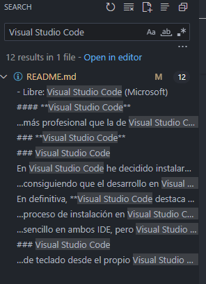

Gracias a la personalización avanzada del entorno, especialmente con la configuración de atajos de teclado para acciones críticas (como abrir terminal, duplicar línea, edición múltiple y previsualización Markdown), mi productividad ha mejorado notablemente. Puedo trabajar sin distracciones, minimizando el uso del ratón y automatizando tareas frecuentes. Al adaptar Visual Studio Code a mis necesidades reales de flujo de trabajo, reduzco errores, ahorro tiempo en tareas repetitivas y dedico mi energía a la lógica y creatividad en el desarrollo.

Respecto a la parte de automatización de tareas he configurado con la extensión **Code Runner** la compilación y ejecucción de mi código en cuestión de segundos a través del atajo de teclado (`Shift + Space`) como se muestra a continuación:


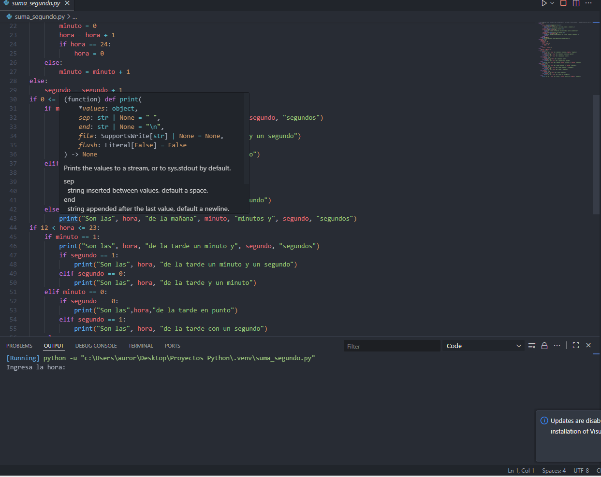

Por ejemplo, al implementar una función nueva, fui validando al instante cada modificación con un solo atajo, detectando errores inmediatamente y acelerando el ciclo de prueba y error.

### IntelliJ IDEA

Antes de empezar, cabe aclarar que he añadido los mismos atajos de teclado en IntelliJ IDEA permitiéndome una edición ágil (abrir terminal, duplicar línea, buscar, edición múltiple, etc.) sin importar el entorno en el que trabaje. Asimismo, he decidido centrar mi personalización en **el entorno visual y la organización del espacio de trabajo** para maximizar la comodidad y el enfoque:

- Personalicé el tema visual a *Darcula*, ajustando además el tamaño de fuente y los colores para los diferentes estilos de sintaxis y brackets, lo que me permite localizar errores y distinguir bloques de código con mayor facilidad.
*Antes*
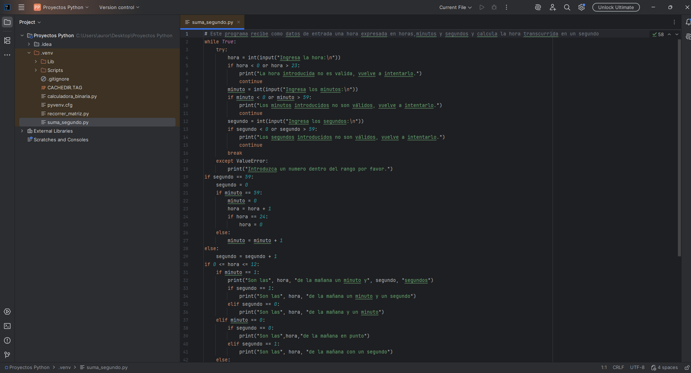
*Después*
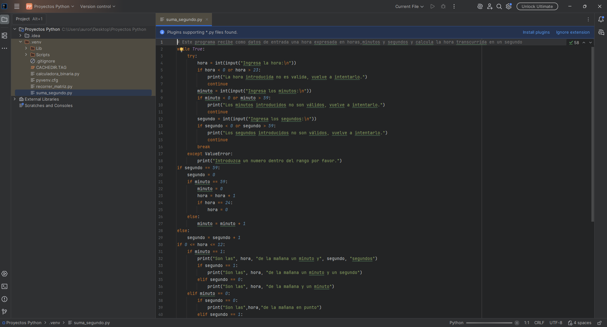

- También reorganicé los paneles laterales y la barra superior para que únicamente se muestren las herramientas más útiles para mi flujo de trabajo , eliminando distracciones y agilizando el acceso.

*Antes*

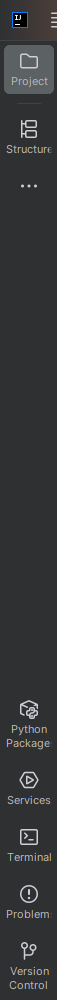

*Después*


En cuanto a las automatizaciones, en IntelliJ IDEA he automatizado los test unitarios, es decir, ahora cada vez que quiera ejecutar los tests de mi proyecto solo tengo que utilizar el atajo de teclas `(Shift + F10)`

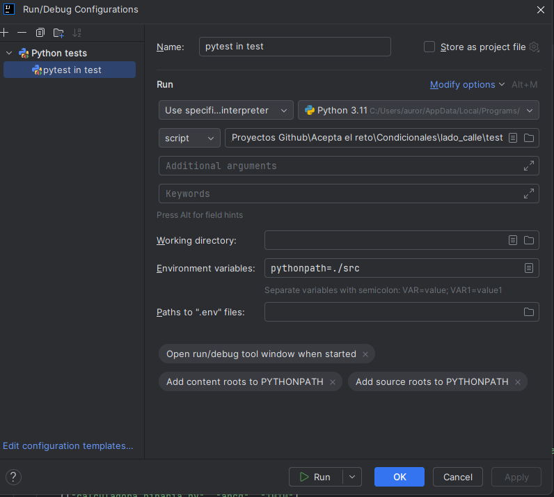


Gracias a esta personalización y automatización, puedo centrarme en la lógica y calidad de mi código, ya que tanto la ejecución de tests como la organización del entorno me permiten detectar errores de forma precoz, trabajar con mayor velocidad y minimizar distracciones innecesarias. Esta metodología resulta especialmente útil en proyectos de Python donde la validación continua y un entorno visual bien configurado marcan la diferencia entre la eficiencia y la frustración.

## Configuración del sistema de actualización del entorno de desarrollo

### Visual Studio Code

Visual Studio Code está diseñado para mantenerse siempre actualizado de manera sencilla ya que por defecto, VS Code se actualiza automáticamente en la mayoría de sistemas operativos (Windows, macOS y muchas distros Linux), aun así, puedes comprobar y configurar este comportamiento pudiendo elegir modo manual o automático.

Aunque si quieres forzar la comprobación manual en cualquier momento puedes hacerlo desde `Ayuda > Buscar actualizaciones` en la barra superior.

No obstante, para poder configurar el comportamiento de las actualizaciones automáticas sigue estos pasos:
1. Ve a Archivo > Preferencias > Configuración.
2. Busca “update mode” o “actualizaciones”.
3. Puedes elegir entre los modos “default” (automático), “manual” o “none” (sin actualizaciones).

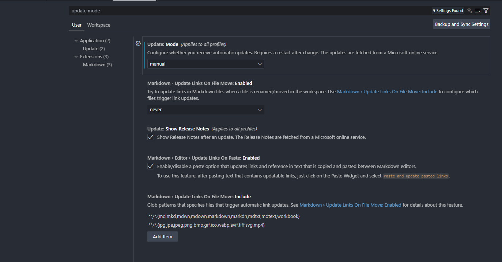

En Windows, por ejemplo, la opción suele estar en `Update: Mode` y vale la pena dejarla en “default” para no perder nuevas funciones y parches de seguridad.

### IntelliJ IDEA

IntelliJ IDEA dispone de un sistema propio de actualizaciones automáticas y manuales que garantiza estar siempre al día con las últimas novedades, parches de seguridad y soporte para tecnologías recientes.

#### ¿Cómo configuré las actualizaciones automáticas?

- Por defecto, IntelliJ IDEA te notifica cuando hay una nueva versión disponible y te da la opción de actualizar directamente desde la interfaz del programa.
- Para gestionar el sistema de actualizaciones, sigue estos pasos:

1. Ve al menú superior **Help > Check for Updates...**
    - Desde ahí puedes comprobar y aplicar cualquier actualización manualmente cuando lo desees.
2. Para ajustar la frecuencia de comprobación y la política de actualizaciones:
    - Ve a **File > Settings > Appearance \ Behavior > System Settings > Updates**.

    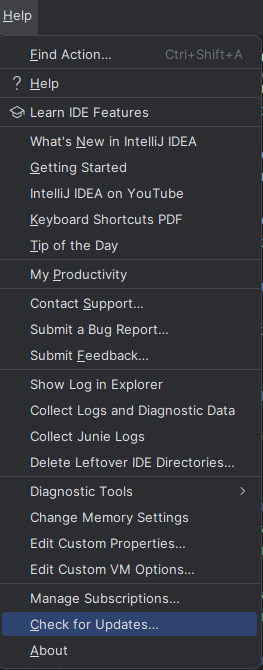

    - Puedes elegir entre “Stable updates”, “Beta updates”, o “EAP (Early Access Program)” para recibir novedades según tu preferencia de estabilidad.
    - Marca la opción para comprobar automáticamente y aplicar parches de seguridad si están disponibles.

    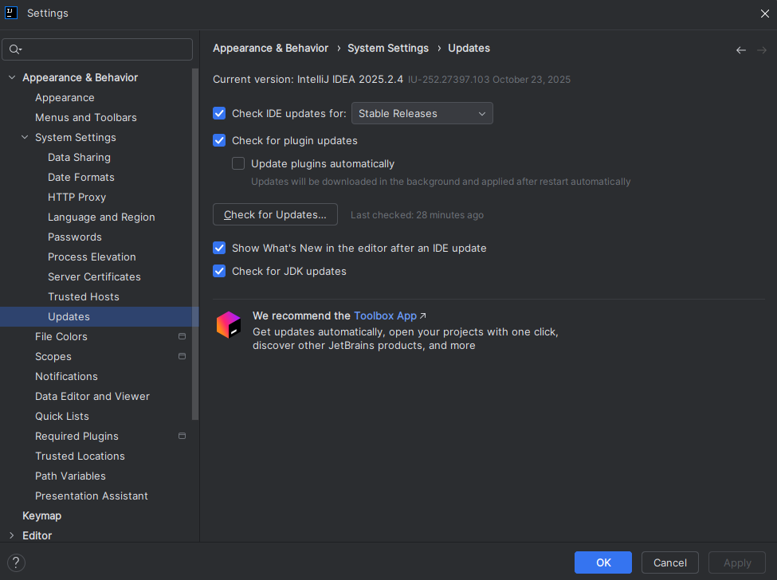


#### ¿Por qué es importante mantener el IDE actualizado en proyectos de desarrollo?

- **Nuevas funcionalidades:** Las actualizaciones traen constantemente soporte para nuevas versiones de lenguajes, frameworks, plugins y mejoras de productividad.
- **Seguridad:** Cada versión corrige vulnerabilidades y errores críticos que podrían poner en riesgo tu código o tus datos.
- **Compatibilidad:** Los plugins y herramientas externas suelen requerir versiones recientes para funcionar correctamente y sacar el máximo partido al entorno.
- **Estabilidad:** Minimizarás sorpresas por bugs antiguos y mejorarás el rendimiento, logrando un entorno de desarrollo más fluido y fiable.

##  Generación de ejecutables a partir de código fuente en distintos lenguajes en un mismo IDE

### 1. Crea Proyecto Java/Kotlin correctamente

**Proyecto Java**

1. Ve a **File > New > Project…**
2. Selecciona **Java y Kotlin** en la lista, elige el SDK (Java 11 o superior recomendado) y pulsa **Next**.
3. Dale un nombre al proyecto, por ejemplo `DespegueJavaKotlin`.
4. Pulsa **Finish**.

Si al crear el proyecto seleccionaste Java y Kotlin juntos, ya tendrás soporte mixto.

### 2. Crea los archivos fuente correctos

A. **Archivo Java**

- Haz clic derecho en la carpeta `src` > **New > Java Class**.
- Nómbralo, por ejemplo, `CuentaAtrasJava`.

Pon este código:

```java
public class CuentaAtrasJava {
    public static void main(String[] args) {
        for (int i = 10; i >= 0; i--) {
            System.out.println(i);
        }
        System.out.println("¡Despegue!");
    }
}
```


B. **Archivo Kotlin**

- Haz clic derecho en la carpeta `src` o `src/kotlin` > **New > Kotlin File/Class**.
- Ponle nombre, por ejemplo, `CuentaAtrasKotlin`.

Pon este código:

```kotlin
fun main() {
    for (i in 10 downTo 0) {
        println(i)
    }
    println("¡Despegue!")
}
```


### 3. Ejecuta ambos programas

- Selecciona el archivo Java y pulsa el **triángulo verde** (o `Shift+F10`).
- Haz lo mismo con el archivo Kotlin.
- Verás en la consola la cuenta atrás de 10 a 0 y el mensaje “¡Despegue!” en ambos casos.

Si resumimos, el proceso en IntelliJ IDEA fue muy sencillo puesto que tan solo tuve que crear dos archivos fuente, uno en Java y otro en Kotlin, ambos en el mismo proyecto y carpeta src. Gracias al soporte nativo del IDE para ambos lenguajes, solo tuve que escribir el código y lanzar la ejecución con el botón de “Run”. El IDE se encargó automáticamente de compilar y ejecutar cada uno en la JVM, mostrando el resultado de ambos en la consola.

De la misma forma, en ambos lenguajes el archivo ejecutable generado es código bytecode `.class` para la JVM, por lo que el proceso técnico es idéntico, aunque, cabe destacar que al ser la sintaxis de Kotlin más sencilla, el archivo fuente se crea más rápido en este lenguaje.

##  Generación de ejecutables con diferentes IDEs a partir del mismo código fuente 

### Código fuente utilizado (Python)

```python
for i in range(10, -1, -1):
    print(i)
print("¡Despegue!")
```

### Ejecución en Visual Studio Code

Para poder ejecutar el programa abrí el archivo `.py` en Visual Studio Code, con la extensión de Python instalada y configuré el intérprete puesto que gracias a la extensión **Code Runner** (o el icono propio de "Run Python File"), pude ejecutar el script con un solo clic o atajo de teclado (`Shift + Space` en mi caso).
Asimismo, la consola integrada de VSC mostró rápidamente la cuenta atrás y el mensaje “¡Despegue!”.
El proceso fue muy ágil, y la integración de la terminal y salida simplifica la detección de errores.


### Ejecución en IntelliJ IDEA

En IntelliJ IDEA, añadí soporte para Python desde los plugins y configuré el intérprete correspondiente para el proyecto (en mi caso el CPython 3.11).
De la misma forma, creé un archivo `.py` y lo ejecuté directamente con el botón de “Run” o el atajo (`Shift + F10`).
Tras eso, el IDE lanzó el script en una ventana propia de ejecución mostrando cada línea de la cuenta atrás y “¡Despegue!”.
La experiencia fue prácticamente igual de fluida que en VSC, pero con un enfoque más IDE tradicional, más opciones de debugging y control total sobre la ejecución.


En cuanto a cuál de los IDEs me resultó más cómodo o eficiente para ejecutar código Python, sinceramente Visual Studio Code me pareció la mejor opción para pruebas rápidas y desarrollo ágil puesto que es ligero, arranca en segundos y la integración de extensiones como Code Runner hace que puedas ejecutar scripts y ver resultados casi al instante, sin rodeos y con total flexibilidad para personalizar el entorno a tu gusto según avance el proyecto.

Por otro lado, IntelliJ IDEA me parece la elección ideal cuando el proyecto de Python es grande o necesita una gestión más profesional dado que ahí se nota la diferencia en herramientas avanzadas de refactorización, el depurador profesional, integración robusta con control de versiones y testeo, aunque es cierto que requiere invertir algo más de tiempo en la configuración inicial y en recursos. Si busco velocidad y sencillez, tiro de VSC; si voy a trabajar en algo serio, en equipo o con muchas dependencias y necesito control total, IntelliJ IDEA es mi opción.